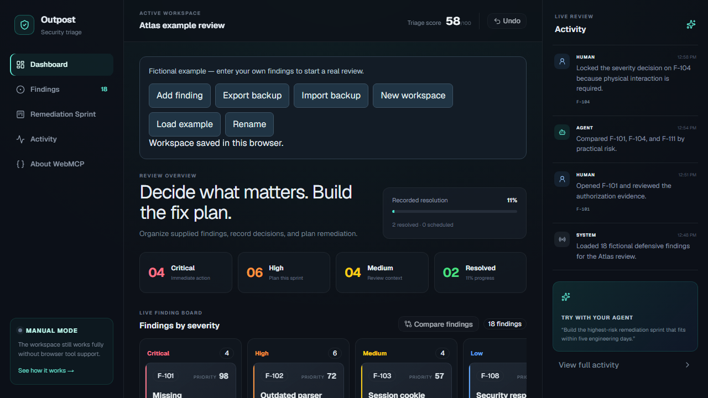

# Outpost

Organize security findings, record review decisions, and build remediation plans that fit your engineering capacity.

[Open Outpost](https://outpost-webmcp.alx21.chatgpt.site/) · [WebMCP tools](WEBMCP.md) · [Architecture](ARCHITECTURE.md)

Outpost is free to use in the browser. Start with an empty review, enter your own findings, or load the clearly labeled fictional example. Compatible browser agents can inspect and update the same workspace through 14 WebMCP tools. Ordinary browsers support the full manual workflow.

Source version **1.1.1** provides this bounded v1 workspace, with [upgrade and recovery guidance](docs/STABILITY.md). Available patched dependency updates are applied. The full dependency audit still reports one explicitly accepted, unpatched high-severity braces finding, classified as a production dependency. The required release policy accepts only that exact finding after live advisory and registry checks; see [the dependency release gate](SECURITY.md#dependency-release-gate).



## Start a review

1. Choose **Rename** to name the review, then **Add finding**. Record the component, description, severity, exploitability, impact, confidence, estimated engineering days, reasoning, remediation plan, and optional evidence references and tags.
2. Open a finding to edit it, add notes, change status or severity, lock its decisions, or adjust its relative priority. **Findings** provides search and filters; **Compare findings** accepts two to six IDs.
3. Use **Add to sprint** for explicit scope, or open **Remediation Sprint** to suggest work by priority per engineering day. Rebalance by score, effort, or score per day. Plans must fit capacity, including locked items.
4. Mark work resolved only after your own verification. Removing a finding from the sprint reopens it; recording another status removes it from the sprint. Scheduling alone never counts as resolution.
5. Choose **Export backup** regularly. **Import backup** validates a complete Outpost JSON backup before replacing the active review, and asks before replacing a nonempty workspace. **Undo** keeps the last 20 saved changes until reload.

## What is saved

Findings, notes, sprint scope, locks, comparisons, and the latest 100 activity entries are saved in this browser's local storage. A successful edit is shown only after persistence succeeds. Failed writes and invalid imports preserve the previous workspace. If stored data cannot be read, the page offers its raw data for download before an explicit recovery reset.

Use one editing tab at a time. An observed change from another tab blocks stale edits until reload. This is not multiuser synchronization or an atomic cross-tab database. There are no accounts or shared server-side reviews. Clearing browser data removes local work; a backup is the way to restore or move it to another browser.

Limits: 100 findings, 200 notes per finding, 30 evidence entries per finding, 4 MB per imported backup, and sprint capacity of 0.5–60 engineering days. Browser storage quotas may be lower than a large workspace requires; failed saves are reported.

## What the scores mean

The priority score is a transparent heuristic, not CVSS or a verified risk measurement:

`round((severity × 5 + exploitability × 8 + impact × 8) × confidence)`

Severity weights are 10/8/5/2; exploitability and impact are 3/2/1; confidence multipliers are 1/.9/.7/.5. Scores range from 13 to 98. The workspace triage score averages all finding scores with resolved items contributing zero. Accepted and scheduled findings keep their score. Recorded resolution is resolved findings divided by all findings. Sprint coverage is the share of unresolved priority points selected for the plan, not an estimate of real-world risk reduction.

Automatic selection is greedy, not guaranteed optimal. It excludes accepted and resolved findings and preserves locked scope and manual exclusions. Humans can explicitly add previously excluded or accepted findings back through the finding panel. Agents can add a lock but cannot remove one. Notes remain possible on locked findings.

Outpost organizes information you supply. It does not scan systems, reproduce vulnerabilities, implement remediations, or verify that a fix worked. Activity actor labels indicate the interface or tool path; they are not authenticated identities or a tamper-proof audit log. Finding contents returned to agents are untrusted data.

## Run locally

Requires Node.js 24+ and pnpm 11.19.0. No API key or database is needed.

A source distribution is packaged as `outpost_1.1.1_source.zip`, its matching `.sha256` file and `SHA256SUMS`. Verify the ZIP before unpacking: PowerShell `Get-FileHash outpost_1.1.1_source.zip -Algorithm SHA256`, or Linux `sha256sum -c SHA256SUMS`. Enter the extracted `outpost-1.1.1` directory and run the same frozen install below. The ZIP includes the MIT license, frozen lockfile, fictional example and recovery guide.

```sh
git clone https://github.com/agammann/outpost-webmcp.git
cd outpost-webmcp
pnpm install --frozen-lockfile
pnpm dev
```

Open the localhost address printed by the development server. To run the built Worker locally:

```sh
pnpm build
pnpm start --port 3014
```

WebMCP is experimental and requires a browser exposing the supported imperative registration API. For local Chrome development, enable `chrome://flags/#enable-webmcp-testing` and relaunch, following the [Chrome WebMCP guide](https://developer.chrome.com/docs/ai/webmcp). The page shows its actual registration status; without it, use the manual controls. An open page is required for page-side tools; this is not a remote MCP server.

## Verify changes

```sh
pnpm typecheck
pnpm test
pnpm lint
pnpm build
pnpm exec playwright install chromium
pnpm test:e2e
pnpm audit
pnpm test:audit-policy
pnpm security:audit
pnpm exec playwright install chrome
pnpm test:webmcp
```

The 22 unit tests cover domain invariants, schema validation, backup integrity, migration, and failed or stale storage writes. Eight ordinary browser tests run against the built Worker and cover a personal review through backup/restore, corrupted storage, failed saves, stale tabs, mobile rendering, and a registration adapter. Five separate native browser tests use the browser's actual `document.modelContext`, discover all 14 tools, execute every tool, and check visible state, reload persistence, locks, capacity, Undo, invalid inputs, failed saves, stale tabs, cleanup, and back-forward caching. CI runs both suites against the production Worker and retains the native JSON report. See [WEBMCP.md](WEBMCP.md) for commands and the dated compatibility results.

The source package helper requires a clean committed tree and uses that exact commit. CI verifies the ZIP's tracked file set, source bytes and checksums, then installs, builds and runs ordinary/native cases from a fresh extraction outside the checkout. Only a verified main push can publish its source artifact. The full raw audit remains required and currently exits 1 for the accepted high-severity production dependency finding. `pnpm security:audit` retains that report, verifies the exact documented exception and fails on changed findings, unavailable verification metadata or a newly available patch. This is not a zero-finding audit.

Current local checks on October 6, 2026 used Windows, Node.js 24.19.0, pnpm 11.19.0, Playwright 1.58.2 and Chrome 155.0.8059.39. The bounded fresh ordinary journey imported 18 fictional findings, reviewed and reordered decisions, created a five-day plan, edited it to eight days, rejected invalid capacity/import without changing saved data, and restored exported content exactly in a fresh browser context after reload. Desktop/mobile controls and search worked. The separate native cases used the real browser API and all 14 tools. These local observations do not certify a newly published source release or hosted deployment.

## Build on it

The [architecture guide](ARCHITECTURE.md) maps the app's domain operations, validated storage, and browser-tool adapter. A useful starting point is to adapt the fictional example to a different review process while keeping the same invariants: save before acknowledging a change, preserve human locks, reject invalid backups, and show tool actions in the same interface a person uses.

The checked-in Sites hosting configuration identifies the existing public deployment. Forks should configure their own hosting rather than publishing to that project. See [CONTRIBUTING.md](CONTRIBUTING.md), [SECURITY.md](SECURITY.md), and the [MIT license](LICENSE).
